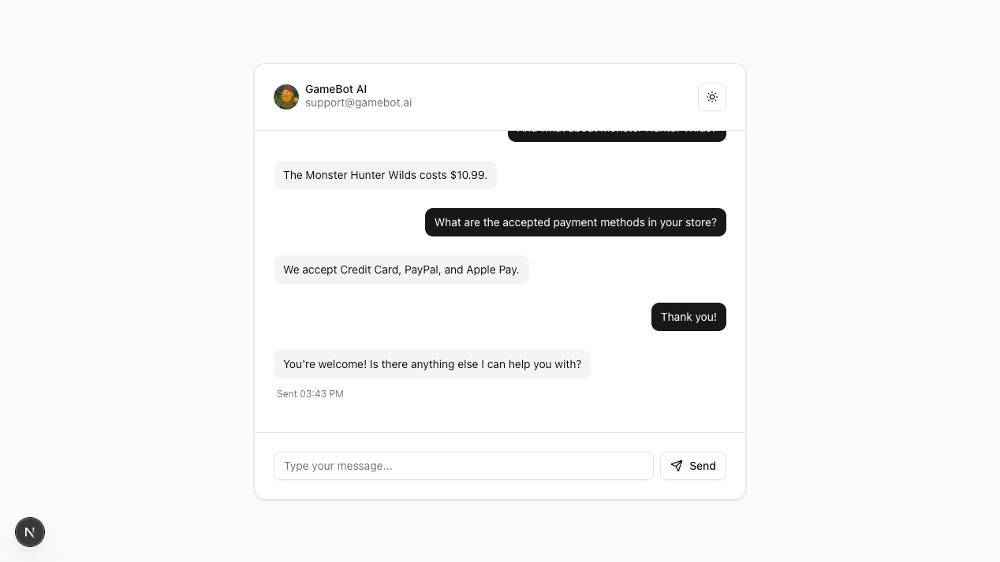
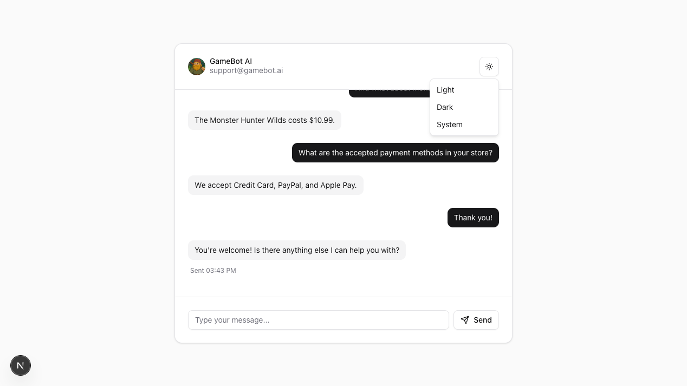
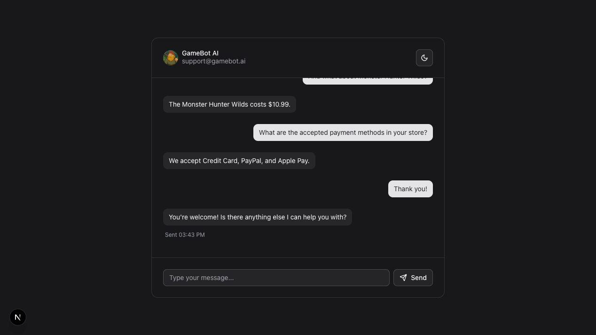

# Gamebot AI

Gamebot AI is an AI-powered chatbot that helps users search for games, check their availability, and obtain information about promotions and hardware compatibility.

### Description

Gamebot AI is a smart, AI-powered chatbot built into the Acme Corp. game store — a digital platform similar to Steam that offers a wide selection of PC games. At its core, Gamebot uses Gemini, a cutting-edge AI assistant, to deliver fast, context-aware, and helpful responses in real time.

It helps users find what they need quickly and easily by handling tasks like:

- Checking the current price of a specific title.
- Listing accepted payment methods.
- Checking the status of placed orders.

The chatbot is designed with user experience in mind. It supports both dark and light modes for better visual comfort, depending on user preference or system settings. It’s also fully A11y-friendly — offering keyboard navigation, screen reader support, and compliance with WCAG accessibility standards, making it accessible to all users.

### Target

Gamebot AI is built for:

- PC gamers who want quick access to game info without browsing through menus.
- Players who need to confirm if a game will run on their system.
- Acme Corp. customers checking payment options or tracking orders.
- New users looking for simple guidance through the store.

### Technology

TypeScript, React, Next.js, TailwindCSS, Gemini, shadcn/ui, react-hook-form, zod, ai-sdk, motion.

### Screenshots

